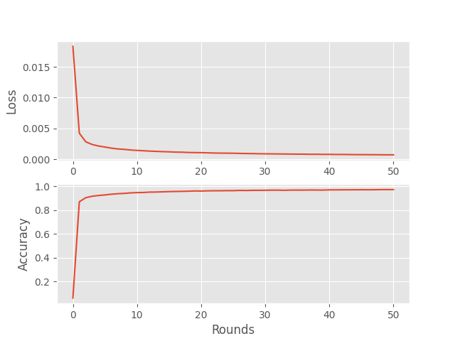

# Flower_Task
A repository that includes a task from Flower. 

In this small task, I have created a custom federated strategy that ensures that half of the participating clients have a permanent learning rate, while the other half have a learning rate that decays with a factor of 0.99.

## Installation
One installs the required packages using [Poetry](https://python-poetry.org/), run the following command in the terminal:
```bash
# Set Python 3.10
pyenv local 3.10.6
# Tell poetry to use python 3.10
poetry env use 3.10.6

# Install the base Poetry environment
poetry install

# Activate the environment
poetry shell
```

## Usage
To run the code, one can run the following command in the terminal:
```bash
bash task/run.sh
```

The run script will run the main code in ```task/main.py``` with different learning rates. The outputs can be seen in the ```_static``` directory. The main code will create a federated simulation after having downloaded MNIST using [Federated Datasets](https://github.com/adap/flower/tree/main/datasets). The simulation will run for 50 rounds, and the results will be printed to the terminal.

### Highlights
The main part of the implementation happens in the ```task/strategy.py``` file. Here, one can find the implementation of the custom strategy. The function ```configure_fit()``` has been modified to include 2 different configuration dictionaries that are passed to each half of the client set. One configuration contains a permanent learning rate, while the other one contains a learning rate that decays. The decay formula considers what the current server round is in order to calculate the correct learning rate. The strategy is implemented as a subclass of the ```flwr.server.strategy.FedAvg``` class. Also, see the results below.

### Results from run with learning rate 0.001
 


## License
[MIT](https://choosealicense.com/licenses/mit/)